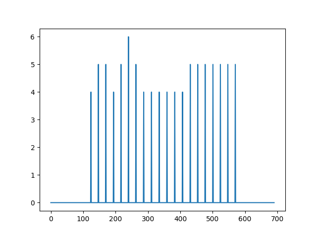
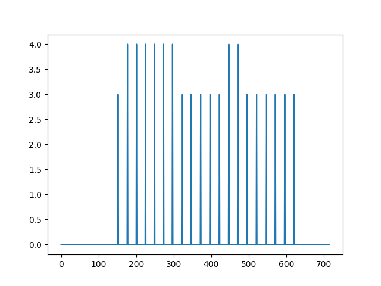
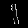
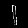
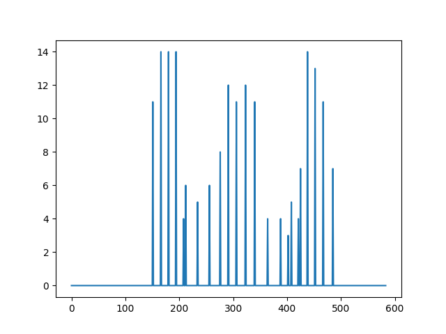
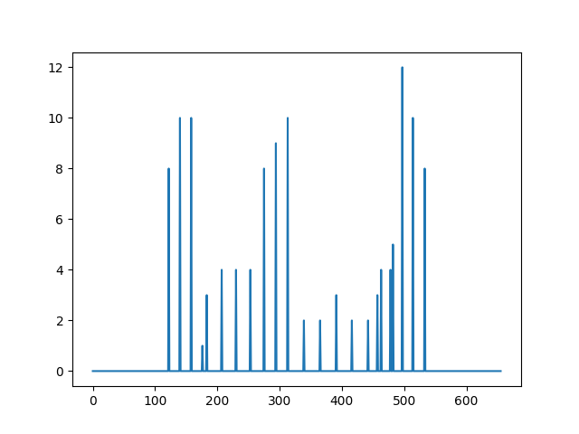
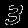
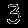

# DeepComponents
Image Recognition by Connected Component-based Deep Neural Networks

## Data
- MNIST
- For each image, for each row within the image matrix, a representative sparse vector is created. In-a-row non-zero values correspond to the connected component of the image within that row. If there are more than one in-a-row non-zero sequences, there are more than one connected components in that image matrix row. 
- For each connected-component representation of each image, an additional abstraction vector is created. 
- In this connected-component-image-vector, for each row of the representation, a row with no connected components is mapped to a 0, and a row with connected components has the lengths of those connected components mapped to an element of the connected-component-image vector with the same value. 
- MNIST data is 784-dimensional. 
- This process reduces dimensionality of MNIST to 51-D at most, and 21-D at least - after removing zeros from generated representation vector
- In the future, I will train the algorithm on the noisier augmented-MNIST dataset. 

## Morse Function Representation

- Digits: 1 (Morse Functions)

- Digits: 1 (Original Pictures)

- Digits: 3 (Morse Functions)

- Digits: 3 (Original Pictures)

## Neural Network
- PyTorch
- Very simple, 2-hidden-layer model with SGD optimization and momentum, Cross-Entropy Loss, ReLU activations. 

## Results
- With the 51-D representation, max accuracy of 88%

## Generation of Images
- Generating Images (with noise) from 51-D representation sequences 
- Under Visualizations/generated
